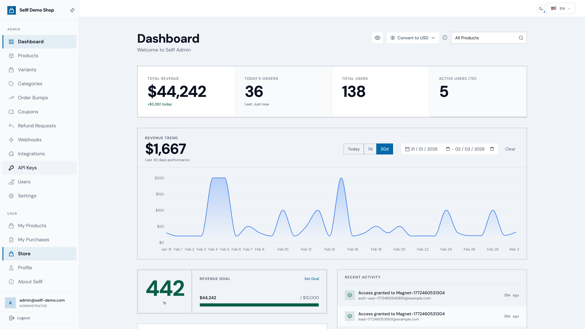
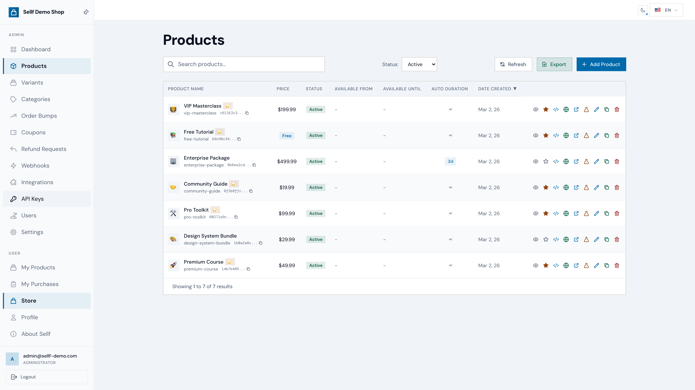
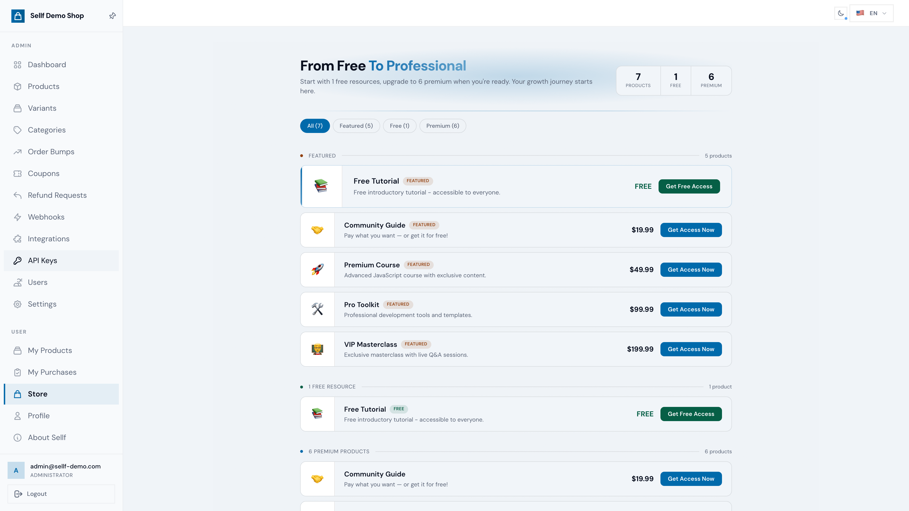
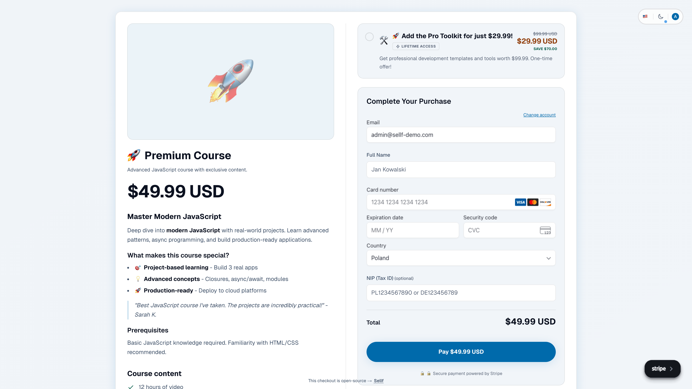
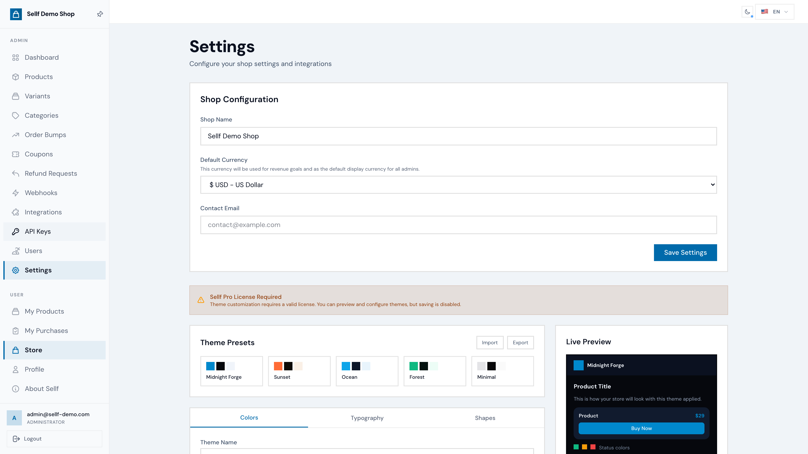
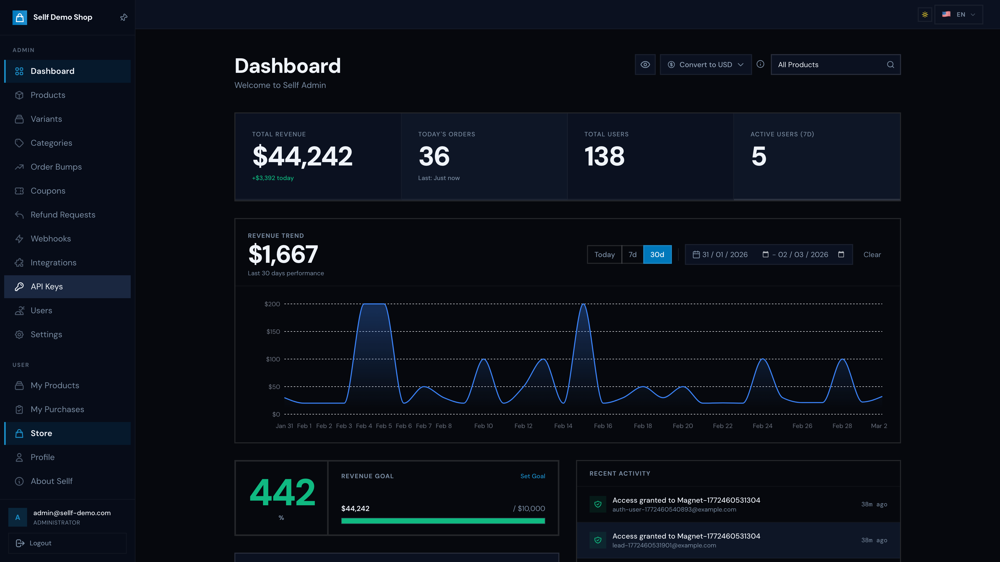
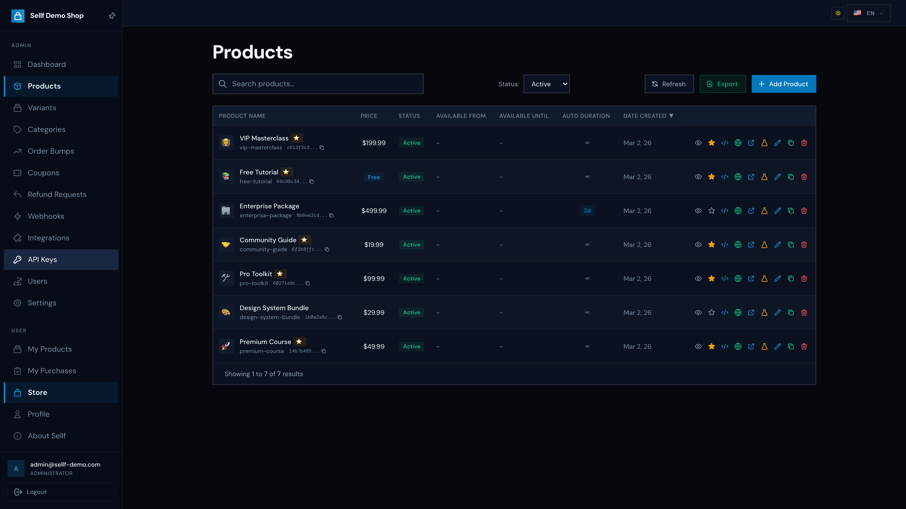

<div align="center">

# Sellf

**Self-hosted platform for selling and protecting digital products**

**An alternative to** Gumroad, LemonSqueezy, Paddle. Zero platform fees.


[🚀 Live Demo](https://demo.sellf.app) · [Documentation](https://docs.sellf.app) · [Quick-Start Guide](https://docs.sellf.app/quick-start/) · [Contributing](./CONTRIBUTING.md) · [Issues](https://github.com/jurczykpawel/sellf/issues)

</div>

<div align="center">
  <br>
  
  <p><em>Admin Dashboard: revenue analytics, sales trends, and product management</em></p>
</div>

---

## Why Sellf?

Sellf gives you **complete control** over your digital product business. No monthly fees to platforms. No revenue sharing. Your data stays on your infrastructure.

- **Stripe-powered payments** with visual setup wizard, no code required
- **One-time and recurring:** sell digital downloads, courses, memberships, SaaS subscriptions in one platform
- **Content protection** that works on any website (WordPress, Webflow, custom)
- **Sales funnels built-in:** One-Time Offers, Order Bumps, Coupons
- **Validate before you build:** waitlists for upcoming products with webhook delivery to your mailer
- **EU-compliant:** Omnibus Directive price history, GDPR consent management
- **Battle-tested:** 3,519 unit tests plus broad Playwright E2E coverage

---

## Features

<details>
<summary><strong>Payments & Checkout</strong></summary>

- Stripe Checkout Sessions with embedded Elements UI
- Guest checkout with Magic Link login
- 26 currencies with automatic conversion
- Pay What You Want (PWYW) pricing
- Coupons (percentage, fixed amount, per-user limits)
- Order Bumps for upselling
- Post-purchase funnel: One-Time Offers (OTO) with fallback Downsell branch and post-purchase coupons for return visits
- Per-product checkout templates (Default, Tip Jar, OTO) with custom field support per product
- Refund management with configurable periods, partial refunds, and outgoing refund webhooks

</details>

<details>
<summary><strong>Subscriptions & Memberships</strong></summary>

- Recurring billing on monthly, yearly, or any Stripe interval (day/week/month/year + count)
- Optional free trials per product (set `trial_days`, card collected upfront, charge after trial)
- Anonymous checkout, no forced login at purchase. Account materializes via webhook after first payment, login (magic link) only needed for the customer portal
- Customer portal in Sellf: cancel/resume, view invoices, update card via Stripe `<PaymentElement>` + SetupIntent. No redirect to a separate Stripe-hosted portal
- Cancel always at period end (customer keeps access until paid period expires)
- Refund policy honors `refund_period_days`. Refund of the first invoice auto-cancels at period end
- Coupons with Stripe-native `duration` (once / repeating N cycles / forever) for promotional pricing
- Outgoing webhooks for every lifecycle event (`subscription.created`, `subscription.updated`, `subscription.canceled`, `subscription.trial_ending`, `subscription.renewal_upcoming`, `invoice.paid`, `invoice.payment_failed`). Plug into n8n, Make, Listmonk, or your own mailer

</details>

<details>
<summary><strong>Waitlist & Pre-Launch Validation</strong></summary>

- Per-product `enable_waitlist` toggle. Inactive product + waitlist on = signup form. Inactive + waitlist off = 404 (so you can hide work-in-progress products without leaks)
- Email capture form with terms acceptance, Cloudflare Turnstile CAPTCHA, and disposable email blocking
- Signed-in users see their account email pre-filled with a one-click "Use a different email" override (no need to re-type for the common case, with escape hatch for shared accounts)
- Webhook delivery on `waitlist.signup` event. Plug into n8n, Make, Listmonk, or any mailer to send confirmation emails and tag subscribers per product
- Admin warnings: missing-webhook banner per product (so you don't accidentally launch a waitlist with nowhere to send signups), and "last webhook handling waitlist" warning when deleting webhooks

</details>

<details>
<summary><strong>Product Management</strong></summary>

- Product variants (Basic/Pro/Enterprise tiers)
- Sale pricing with quantity and time limits
- Timed access (30-day, lifetime, custom)
- Waitlist for upcoming products
- Categories and featured products
- Rich descriptions with Markdown support

</details>

<details>
<summary><strong>Content Protection (Gatekeeper)</strong></summary>

- Page-level or element-level protection
- JavaScript SDK for any website
- Embeddable checkout SDK: drop a `<script>` tag on any external site (modal/inline/button variants, per-product snippet, show-price and button-label customization)
- Self-hosted Playerstack video player: protected video delivery with no third-party hosting
- Custom fallback content for non-buyers
- Multi-product access on single page
- License validation

</details>

<details>
<summary><strong>Marketing & Analytics</strong></summary>

- Google Tag Manager integration
- Facebook Pixel with Conversions API (CAPI)
- Webhooks (HMAC-secured) for Zapier, Make, n8n: purchases, refunds, waitlists, subscriptions, invoices
- Revenue dashboard with goals
- Real-time sales notifications

</details>

<details>
<summary><strong>REST API v1 & Integrations</strong></summary>

- 60+ endpoints covering products, users, payments, refunds, coupons, webhooks, analytics, and more
- Fine-grained API keys with 13 permission scopes (`products:read`, `users:write`, `*`, ...)
- Zero-downtime key rotation with configurable grace period
- Per-key rate limiting (1–1000 req/min)
- Cursor-based pagination with sorting (`sort_by`, `sort_order`), OpenAPI 3.1 spec
- MCP Server for Claude Desktop (45 tools, 4 resources, 6 prompts)
- Bruno API collection for testing (includes all query params)

📖 **[Full API Documentation →](https://docs.sellf.app/api/)**

</details>

<details>
<summary><strong>Compliance & Security</strong></summary>

- EU Omnibus Directive (30-day price history)
- GDPR consent logging
- Cloudflare Turnstile CAPTCHA
- AES-256-GCM encryption for API keys
- Row Level Security (RLS) policies
- Rate limiting (Upstash Redis)
- Audit logging

</details>

For the complete feature list, see **[FEATURES.md](./FEATURES.md)**.

---

## Payment Model: Own Stripe Account

Sellf connects to **your own Stripe account**. You are the seller, payments go directly to you. No middleman, no revenue sharing.

### Cost Comparison at $10,000/month Revenue

| Platform | Fees | Monthly Cost | You Keep |
|----------|------|:------------:|:--------:|
| **Sellf + Stripe** | ~3.4% (Stripe only) | ~$340 | **$9,660** |
| **Paddle** | 5% + 3.5% + $0.30 | ~$880 | $9,120 |
| **LemonSqueezy** | 5% + 3.5% + $0.30 | ~$880 | $9,120 |
| **Gumroad** | 10% + 2.9% + $0.30 | ~$1,290 | $8,710 |

That's **$950/month saved** vs Gumroad, **$11,400/year** back in your pocket.

<details>
<summary><strong>What about taxes? (MoR vs Own Stripe)</strong></summary>

Platforms like Paddle, LemonSqueezy, and Gumroad act as the **Merchant of Record (MoR)**: they process payments on your behalf and handle tax compliance. Sellf takes a different approach:

| | MoR (Paddle, LS, Gumroad) | Sellf + Own Stripe |
|---|---|---|
| **Platform fees** | 5–10% of revenue | **$0** |
| **Payment processing** | Included in platform fee | ~2.9% + 30¢ ([Stripe pricing](https://stripe.com/pricing)) |
| **Tax calculation** | Handled by MoR | Optional via [Stripe Tax](https://stripe.com/tax) (+0.5%) |
| **Tax filing & remittance** | Handled by MoR | Your responsibility |
| **Customer data** | Held by the MoR platform | **Fully yours** |
| **Vendor lock-in** | Customer and payment data tied to platform | **No. Self-hosted, fully portable.** |
| **Platform risk** | Account freezes, shutdowns possible | **None. You control everything.** |

**When does tax compliance become relevant?**

For EU-based sellers, the [VAT One Stop Shop (OSS)](https://vat-one-stop-shop.ec.europa.eu/) threshold is **€10,000/year** in cross-border B2C sales. Below this, you only handle VAT in your own country. Above it, you register for OSS (a single EU-wide filing) and can use [Stripe Tax](https://stripe.com/tax/pricing) to automate calculations.

**Growth path:**
1. **Starting out:** sell in your country, handle VAT normally
2. **Growing (>€10K cross-border):** enable [Stripe Tax](https://stripe.com/tax) in Sellf admin panel (+0.5% per transaction), register for EU OSS
3. **Scaling:** consider [Stripe Managed Payments](https://docs.stripe.com/connect/managed-payments) (Stripe as MoR) or a tax accountant

> **Note:** This is general information, not tax advice. Tax obligations depend on your country, business type, and revenue. Consult a qualified tax professional for your specific situation.

</details>

---

## Live Demo

Try Sellf without installing anything: **[demo.sellf.app](https://demo.sellf.app)**

- Full admin panel access, browse products, dashboard, settings
- Test checkout with Stripe test cards (`4242 4242 4242 4242`)
- Data resets every hour

<details>
<summary><strong>Screenshots</strong></summary>
<br>

| | |
|:---:|:---:|
|  |  |
| **Products:** manage pricing, status, and visibility | **Storefront:** your public store with free & premium products |
|  |  |
| **Checkout:** one-page purchase with upsells and tax fields | **Settings:** 5 theme presets with live preview |
|  |  |
| **Dashboard** (dark mode) | **Products** (dark mode) |

</details>

---

## Quick Start

### Prerequisites

- [Bun](https://bun.sh/) v1.1+ (runtime & package manager)
- [Docker](https://www.docker.com/) (for local Supabase)
- [Supabase CLI](https://supabase.com/docs/guides/cli) v2.45+

### Run Locally

```bash
# 1. Clone
git clone https://github.com/jurczykpawel/sellf.git
cd sellf

# 2. Start database
npx supabase start

# 3. Install & configure
cd admin-panel
bun install
cp .env.example .env.local  # Edit with your keys

# 4. Run
bun run dev
```

Open **http://localhost:3000**. The first registered user becomes admin.

### Build for Production

```bash
cd admin-panel
bun run build
bun start
```

---

## Tech Stack

| Layer | Technology |
|-------|------------|
| Framework | Next.js 16 (App Router, Turbopack) |
| Language | TypeScript 5.9 |
| Database | Supabase (PostgreSQL + Auth + Realtime) |
| Styling | Tailwind CSS 4 |
| Payments | Stripe (Checkout Sessions, Elements, Webhooks) |
| Testing | Playwright E2E + Vitest/Bun unit tests |
| i18n | next-intl (EN, PL) |

---

## Architecture

```
sellf/
├── admin-panel/       # Next.js app (main codebase)
│   ├── src/
│   │   ├── app/       # App Router (pages, API routes)
│   │   ├── components/# React components (admin, checkout, UI)
│   │   ├── lib/       # Services, utils, Stripe, Supabase
│   │   ├── messages/  # i18n (EN, PL)
│   │   └── types/     # TypeScript definitions
│   └── tests/         # Playwright E2E + Vitest unit
├── mcp-server/        # MCP server for Claude Desktop
├── supabase/          # Migrations, seed data, RPC functions
├── bruno/             # API collection (Bruno client)
├── scripts/           # Utility scripts
└── docs/              # Deployment guides
```

---

## Configuration

All integrations can be configured via the admin panel (encrypted storage) or environment variables.

| Integration | Admin Panel | Env Variables | Notes |
|-------------|:-----------:|:-------------:|-------|
| Stripe | ✓ | ✓ | Visual wizard available |
| GUS REGON (PL) | ✓ | - | Polish company auto-fill |
| Currency Rates | ✓ | ✓ | ECB free, or paid providers |
| Google Tag Manager | ✓ | - | Container ID |
| Facebook Pixel | ✓ | - | Pixel ID + CAPI token |

See **[FEATURES.md](./FEATURES.md)** for details on all integrations.

---

## Deployment

### One-Click Deploy

[](https://vercel.com/new/clone?repository-url=https%3A%2F%2Fgithub.com%2Fjurczykpawel%2Fsellf&root-directory=admin-panel&env=SUPABASE_URL,SUPABASE_ANON_KEY,SUPABASE_SERVICE_ROLE_KEY,STRIPE_SECRET_KEY,STRIPE_PUBLISHABLE_KEY,SITE_URL,CHECKOUT_BINDING_SECRET,TRUSTED_PROXY,APP_ENCRYPTION_KEY,LOGINWALL_SECRET&envDescription=All%20variables%20required%20for%20a%20production%20deploy.%20The%20%2Asecret%2A%2Fkey%20fields%20need%20to%20be%20generated%20locally%20—%20see%20guide%20for%20one-liner%20commands.%20Set%20TRUSTED_PROXY%3Dtrue%20literally.&envLink=https%3A%2F%2Fdocs.sellf.app%2Fquick-start%2F&project-name=sellf&repository-name=sellf)
[](https://app.netlify.com/start/deploy?repository=https://github.com/jurczykpawel/sellf&base=admin-panel)

> **👋 First time setting up an online store?** Read the **[QUICK-START guide](https://docs.sellf.app/quick-start/)** — it's a click-by-click walkthrough that gets you online in ~20 minutes using only your web browser. No terminal, no programming.

> **Already done this before?** The Vercel/Netlify buttons above lead to the deploy form. See the [detailed deploy guide](https://docs.sellf.app/deployment-vercel-netlify/) for what to paste into each field. For just the Supabase database part, see [Supabase setup](https://docs.sellf.app/supabase-setup/).

> **Self-hosting on your own server:** see [Coolify](https://docs.sellf.app/deployment-coolify/) (easiest self-hosted), [Mikrus / VPS](https://docs.sellf.app/deployment-mikrus/) (cheap VPS via PM2), or [Full-Stack](https://docs.sellf.app/full-stack/) (full Docker Compose with self-hosted Supabase).

### Manual Deploy

| Guide | Best For |
|-------|----------|
| **[Quick-Start](https://docs.sellf.app/quick-start/)** | First-time deploy via the Vercel button (recommended for non-technical users, $0/month to start) |
| **[VPS / mikr.us](https://docs.sellf.app/deployment-mikrus/)** | Cheapest path — your own Linux VPS (~$1-5/month, requires terminal) |
| **[Coolify](https://docs.sellf.app/deployment-coolify/)** | Self-hosted with a nice dashboard, ~$9/month on Hetzner |
| **[All deployment options](https://docs.sellf.app/deployment/)** | Docker, Full-Stack, PM2 Cluster, and other advanced setups |

> **Server requirements:** Sellf alone runs on 384 MB RAM. Benchmarked at **0 errors under 30 concurrent users** on a [$9/year VPS](https://mikr.us/?r=pavvel). No Docker needed — plain Node.js + PM2.

---

## Documentation

| File | Description |
|------|-------------|
| [📖 docs.sellf.app](https://docs.sellf.app) | Full searchable documentation (Quick Start, Deployment, API, Configuration) |
| [FEATURES.md](./FEATURES.md) | Complete feature list with roadmap |
| [Quick Start](https://docs.sellf.app/quick-start/) | Beginner-friendly deploy guide (browser-only, ~20 min) |
| [Deployment](https://docs.sellf.app/deployment/) | All deployment paths with decision tree |
| [Stripe Testing Guide](https://docs.sellf.app/stripe-testing-guide/) | Testing payments locally |
| [BACKLOG.md](./BACKLOG.md) | Development roadmap |
| [mcp-server/README.md](./mcp-server/README.md) | MCP Server setup guide |

---

## Roadmap

- [x] Dark/Light theme with admin control
- [x] Theme System (presets, editor, import/export)
- [x] REST API v1 with OpenAPI 3.1
- [x] MCP Server for Claude Desktop
- [x] Simple Funnel System (OTO chaining)
- [x] Stripe Subscriptions (recurring billing, trials, coupon duration, customer portal)
- [ ] Zero-Config Setup Wizard (no .env needed)
- [ ] Transactional Emails & Logs
- [ ] Invoicing Integration (Fakturownia, KSeF)
- [ ] Subscription upgrades/downgrades and MRR/churn dashboard

Full roadmap: [BACKLOG.md](./BACKLOG.md)

---

## Project Stats

```
├── 3,519 unit tests + broad Playwright E2E coverage
├── 90+ API routes (v1 REST API + admin + public)
├── 36 database tables
├── 73 RPC functions
├── 92 RLS policies
├── MCP Server (45 tools, 4 resources, 6 prompts)
└── 2 languages (EN, PL)
```

---

## Support This Project

Sellf is free and open source. If it saves you money on platform fees, consider supporting development by buying Sellf Pro — it removes the "Powered by Sellf" watermark and unlocks the Theme Editor.

| Tier | Price | What it unlocks |
|------|-------|-----------------|
| **Free** | $0 | Everything core — unlimited products, sales, buyers (AGPL-3.0) |
| **Registered** | $0 | + payment CSV export (free key from sellf.app) |
| **Pro** | $59 one-time | + remove "Powered by Sellf" branding, Theme Editor, granular API-key scopes |
| **Business** | Talk to us | Custom / enterprise — [hello@sellf.app](mailto:hello@sellf.app) |

**[Get Sellf Pro →](https://sellf.techskills.academy/checkout/sellf-pro)**

---

## Contributing

Contributions are welcome! See [CONTRIBUTING.md](./CONTRIBUTING.md) for development setup and guidelines.

Ways to contribute:
- Report bugs via [Issues](https://github.com/jurczykpawel/sellf/issues)
- Submit feature requests
- Open Pull Requests
- Improve documentation or translations

---

## Security

Sellf handles sensitive data (Stripe API keys, payment transactions, user accounts), so security is treated as a first-class requirement, not an afterthought.

**What we do:**

- **Regular penetration testing** — automated and manual security audits covering OWASP Top 10, with 280+ test cases across authentication, authorization, input validation, CORS, CSRF, injection vectors, business logic, and infrastructure
- **Row Level Security (RLS)** on every database table — enforced at the PostgreSQL level, not just the application layer
- **Zero platform access to your keys** — Stripe credentials are stored in your `.env.local` on your server. Sellf never phones home, has no telemetry, and no external API calls except to Supabase and Stripe
- **Built-in Security Audit panel** — Settings > System runs 11 automated checks against your Supabase and app configuration, with actionable fix instructions for each issue found
- **Secure defaults** — CORS locked to your domain only, `HttpOnly` + `Secure` cookies, Content-Type validation, rate limiting on all public endpoints, webhook signature verification

**Your Stripe keys stay on your server.** Sellf is fully self-hosted — there is no SaaS component, no cloud dependency, and no way for anyone (including us) to access your credentials.

See [SECURITY.md](./SECURITY.md) for reporting vulnerabilities.

---

## Acknowledgments

Built with [Next.js](https://nextjs.org/), [Supabase](https://supabase.com/), [Stripe](https://stripe.com/), [Tailwind CSS](https://tailwindcss.com/), [Playwright](https://playwright.dev/), [Vitest](https://vitest.dev/), and [next-intl](https://next-intl.dev/).

---

## License

AGPL-3.0. See [LICENSE](./LICENSE) for details.

---

<div align="center">

**[Website](https://sellf.app)** · **[Documentation](https://docs.sellf.app)** · **[Report Bug](https://github.com/jurczykpawel/sellf/issues)**

</div>


